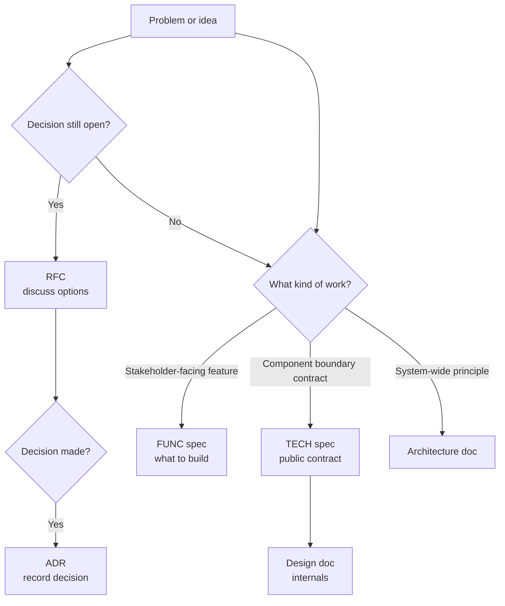
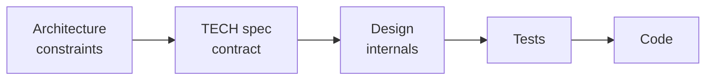

# AGENTS.md — Repository Agent Instructions

This file defines conventions for AI agents working in this repository.
Read this file before performing any task involving code, documentation, or configuration.

---

## Repository Overview

This repository contains a Visual Studio solution with both C++ and .NET projects.

- `src/` — source code (C++ and .NET projects)
- `docs/` — all documentation (architecture, design, specs, ADRs, RFCs)
- `scripts/` — build and utility scripts
- `.github/` — GitHub Actions workflows and issue templates

---

## Documentation Structure

| Folder | Purpose | Mutability |
| ------ | ------- | ---------- |
| `docs/architecture/` | System-level data flows, pipelines, cross-cutting invariants | Stable — change only with ADR |
| `docs/design/` | Component internals, trade-offs, implementation rationale | Active — updated as implementation evolves |
| `docs/specs/functional/` | What the system does (stakeholder-facing) | Versioned |
| `docs/specs/technical/` | How the system does it (developer-facing contracts) | Versioned |
| `docs/adr/` | Accepted architectural decisions — immutable history | **Never delete or rewrite** |
| `docs/rfc/` | Open proposals under discussion — can be freely edited | Draft |
| `docs/testing/` | Test strategy and conventions per language | Active |
| `docs/security/` | Threat model and coding standards | Active |
| `docs/templates/` | Document templates — do not treat as real docs | Stable |

---

## Rules for Agents

### Always

- Read `docs/glossary.md` before working on any documentation task
- Use templates from `docs/templates/` when creating new documents
- Cross-link new docs to related ADRs in the `References` section
- Update the relevant `README.md` index when adding a new file
- Follow the header format defined in `docs/STYLE.md`

### Working in an existing codebase (brownfield)

Most work happens in codebases that already have code, specs, and architecture
docs. Before creating any new document or proposing a change:

1. **Scan for existing artefacts** — search `docs/specs/`, `docs/architecture/`,
   `docs/design/`, and `docs/adr/` for documents covering the same area.
   Prefer **updating an existing document** over creating a new one.
2. **Read the existing code** — understand current behaviour before specifying
   new behaviour. Reference existing modules, classes, and contracts by name.
3. **Account for backward compatibility** — if the change modifies a public
   contract, the spec must include a migration or deprecation plan (who consumes
   the old contract, what breaks, how they migrate).
4. **Acknowledge what already works** — specs and design docs should state what
   is being kept, not just what is changing. Use a "Current State" paragraph in
   the Background section.
5. **Prefer incremental change** — favour extending existing patterns over
   introducing new ones. If a new pattern is needed, record the reason in an ADR.

### Never

- Delete or rewrite files in `docs/adr/` — supersede them with a new ADR instead
- Modify `docs/templates/` files as content — they are templates only
- Use YAML front matter — use the inline header block format (see `docs/STYLE.md`)
- Create a new ADR for a decision still under discussion — use `docs/rfc/` instead

### When proposing an ADR

1. Check `docs/rfc/` for an existing RFC on the same topic
2. Assign the next sequential ID by scanning `docs/adr/`
3. Use `docs/templates/adr.md` as the base
4. Update `docs/adr/README.md` index

### When updating a spec

- Preserve the changelog table at the bottom of the document
- Bump the version in the document header
- Do not remove superseded content — mark it as deprecated inline
- Follow the spec status lifecycle: `Draft → Under Review → Approved → In Progress → Implemented → Verified`
- Never move a spec past `Draft` without filling the **Reviewed by** field
- Never set status to `Approved` — only a human reviewer can approve specs
- When setting status to `Under Review`, freeze content except for review-driven edits

### Traceability: specs → tests → implementation

- When writing tests for a spec, prefix test names with the AC ID (e.g. `AC01_MethodName_State_Expected`)
- After writing a test, fill the **Test** column in the spec's Acceptance Criteria table (section 6)
- After implementing an AC, update the spec's **Implementation Status** table (section 8) with the PR/commit reference
- When a spec reaches status `Implemented`, every AC row must have a PR link
- When a spec reaches status `Verified`, every AC row must have a verified date
- Reference spec IDs in commit messages and PR descriptions (e.g. `Implements TECH-001, AC-02`)

### Task decomposition

When a spec moves to `Approved`, break it into tasks before starting implementation:

- Populate the spec's **Tasks** table (section 7) with small, ordered work items
- Every acceptance criterion must be covered by at least one task
- Each task should be independently implementable and testable in isolation
- Order tasks by dependency — a task may list earlier tasks in its `Depends On` column
- Prefer concrete actions ("Create registration endpoint with email validation") over vague ones ("Build auth")
- Update task status as work progresses: `Pending → In Progress → Done → Blocked`
- When all tasks for an AC are `Done`, update the corresponding row in Implementation Status (section 8)

### Workflow sizing

Not every change needs the full ceremony. Choose the workflow tier that matches
the size and risk of the work:

| Tier | Name | When to use | Required artefacts |
| ---- | ---- | ----------- | ------------------ |
| **S** | Patch | Bug fix, typo, config tweak — no behaviour change | PR only |
| **M** | Focused | Single-component feature, clear scope, ≤ 3 ACs | Spec (FUNC or TECH) → code |
| **L** | Standard | Multi-AC feature or cross-component contract | Spec → tasks → code |
| **XL** | Full | New system, open question, or cross-cutting change | RFC → ADR → spec → plan → tasks → code |

#### How to pick the tier

1. **Does this change behaviour observable by users or other components?**
   No → **S** (patch). Skip specs entirely; describe the fix in the PR.
2. **Is there an open question or multiple viable approaches?**
   Yes → **XL**. Start with an RFC.
3. **Does this touch more than one component boundary?**
   Yes → **L** or **XL**. A spec + tasks breakdown is needed; add an architecture doc
   or RFC if the cross-component interaction is novel.
4. **Otherwise** → **M**. Write a focused spec, implement, done.

> **When in doubt, pick one tier higher.** Under-specifying costs more than
> over-specifying for changes that turn out to be complex.

#### Tier rules for agents

- **S**: No spec required. Reference the issue or bug in the PR.
- **M**: Create a spec with filled ACs. Tasks table (section 7) is optional — use it
  only if the work spans multiple PRs.
- **L**: Create a spec, populate the tasks table, and update Implementation Status
  as each task is completed.
- **XL**: Follow the full workflow described below (RFC → ADR → spec → plan → tasks).

### Spec-Driven Development Workflow

This repository follows a spec-driven development approach. Documents are created
in a specific order that moves from open questions to verified implementation.

#### Document creation flow



<details>
<summary>Text version</summary>

```text
Problem or idea
  │
  ├─ Decision still open? ──────────► RFC (discuss options)
  │                                      │
  │                                      ▼
  │                               Decision made? ──► ADR (record decision)
  │
  ├─ Stakeholder-facing feature? ──► FUNC spec (what to build)
  │
  ├─ Component boundary contract? ─► TECH spec (public contract)
  │                                      │
  │                                      ▼
  │                               Implementation? ─► Design doc (internals)
  │
  └─ System-wide principle? ───────► Architecture doc
```

</details>

#### Decision tree: which document type?

| Question | If yes |
| -------- | ------ |
| Is the decision still under discussion? | Write an **RFC** |
| Has a significant architectural decision been made? | Write an **ADR** |
| Are you defining what the system should do for stakeholders? | Write a **FUNC spec** |
| Are you defining a public contract between components? | Write a **TECH spec** |
| Are you explaining internal implementation choices? | Write a **design doc** |
| Are you describing system-wide data flows or invariants? | Write an **architecture doc** |

#### Flow between document types

Architecture docs define **system-wide constraints** that TECH specs must respect.
TECH specs define **public contracts** that design docs must implement behind the interface.



<details>
<summary>Text version</summary>

```text
Architecture (constraints) → TECH spec (contract) → Design (internals) → Tests → Code
```

</details>

- An RFC may produce an ADR, a spec, or both.
- A TECH spec should reference the architecture constraints it satisfies.
- A design doc should reference the TECH spec whose contract it implements.
- Tests are derived from spec acceptance criteria (see Traceability section above).

---

## Code Conventions

### C++ Projects

- Standard: C++17 minimum
- Build system: CMake
- No raw owning pointers — use `std::unique_ptr` / `std::shared_ptr`
- No `using namespace std` in headers

### .NET Projects

- Target framework: as specified per project `.csproj`
- Nullable reference types enabled
- No `var` for non-obvious types

---

## Files Agents Must Not Modify

- `AGENTS.md` (this file) — humans only
- `CONTRIBUTING.md` — humans only
- `LICENSE` — humans only
- Any file in `docs/adr/` — immutable history
